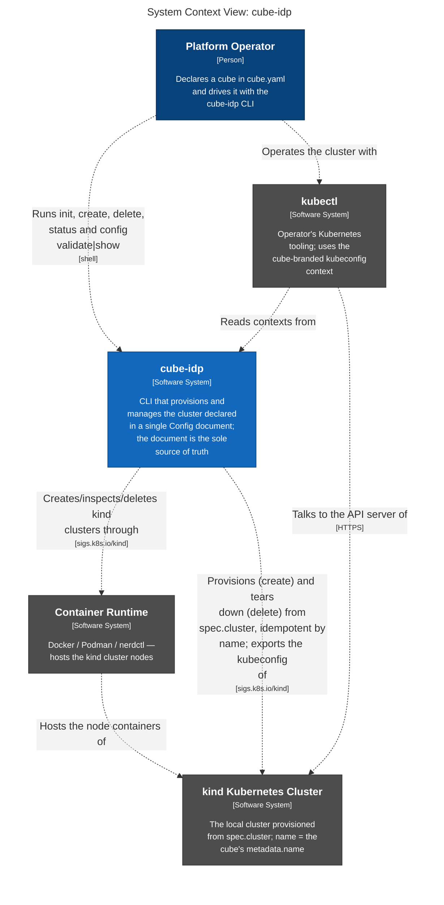
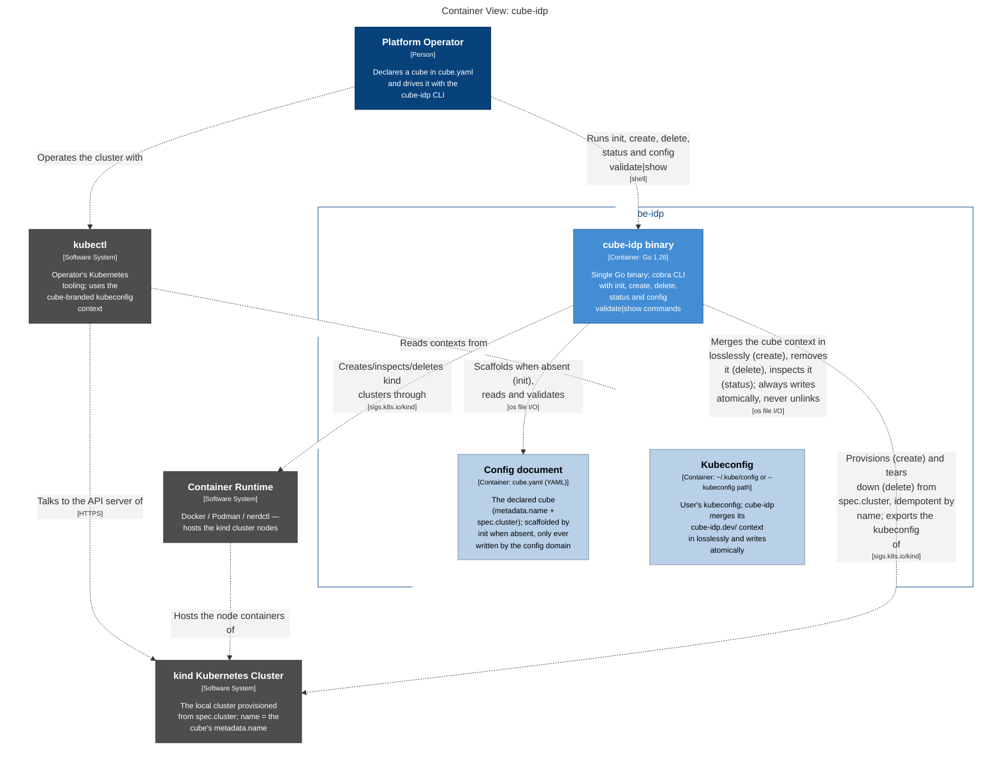
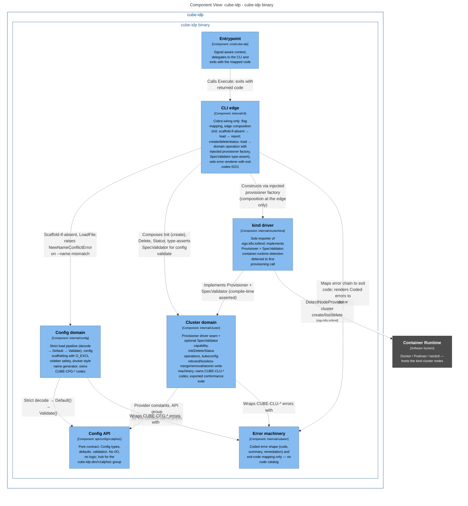

# cube-idp architecture (living document)

This is the binding, cross-cutting architecture of cube-idp — updated in
place as domains land, never forked into dated copies. Per-domain contracts
live in `docs/domains/<name>.md` (one file per domain, created when the
domain lands). Dated decisions and their rationale: `docs/DECISIONS.md`.
Pre-reset history: `docs/archived/` (read-only, not binding). The original
approved design this document grew from is
`docs/archived/design/2026-07-27-back-to-basics-structure.md`.

## 1. Structure in one line

Standard Go layout (`cmd/` + `internal/` + public `api/`); one package per
component domain inside `internal/`; consumer-side interfaces by default
with a driver-pattern exception for swappable backends; error machinery
separated from per-domain error catalogs; a thin phase-runner orchestrator
(future); CI-enforced size limits.

## 2. Layout and import direction

```
cmd/cube-idp ──▶ internal/cli ──▶ internal/config  ──▶ api/config/v1alpha1
                      │      └──▶ internal/cluster ──▶ api/config/v1alpha1
                      │                │  └── cluster/kind (driver subpackage)
                      └──────▶ internal/cubeerr ◀──── (config, cluster)
```

- Imports flow strictly left to right. `api/` and `internal/cubeerr` are
  leaves: they import nothing from `internal/` — ever.
- Domains never import each other. Values cross domains by injection at
  the CLI/orchestrator edge, where factories and composition live.
- One component domain = one package under `internal/` = one file under
  `docs/domains/`. New components add a package; they never grow an
  existing one.
- Driver subpackages (`internal/cluster/kind`) are the only importers of
  their backend SDK.

## 3. The Config API

One aggregate `Config` kind in root group `cube-idp.dev` (`v1alpha1`),
KRM-shaped and CRD-ready: real `metav1.TypeMeta`/`ObjectMeta`, deepcopy
generated by controller-gen and committed. `ConfigSpec` grows exactly one
typed sub-struct per component, with its defaults and validation beside it;
the loading machinery never changes. Load pipeline order is fixed: strict
decode → `Default()` → `Validate()`; a non-nil `*Config` is always complete
and valid. Per-component API groups (`<component>.cube-idp.dev`) are
reserved for kinds a component actually owns, never applied preemptively.

## 4. Interface doctrine

Two kinds of seams, bright line between them:

- **Kind A — consumer-side (the default):** the consuming package defines
  the 1–3 method interface it needs, only once a real second consumer or
  implementation exists. Domains return concrete structs. Mocks are
  hand-rolled function-field structs — no mockgen. Test seams are
  injected — a factory is passed as a parameter or struct field to the
  code that uses it, never exposed as a mutable package-level `var` that
  tests overwrite with save/restore; mutable package-level state is
  banned outside `main`.
- **Kind B — driver seams (the exception):** only for genuinely swappable
  backends (cluster providers, gitops engines). Interface + exported
  `Run<Seam>Conformance(t, factory)` suite live in the domain package;
  implementations live in subpackages and each runs the shared suite.
  Interfaces stay pure where possible (return objects; the caller
  applies); optional capabilities are separate small type-asserted
  interfaces; seams narrow over time, never widen casually.

Current seams: `cluster.Provisioner` (Kind B, kind driver).

## 5. Error architecture

Machinery (`internal/cubeerr`: `Code`, `Coded`, `Wrap`, `ExitCode`) is
separated from catalogs and never grows one. Each domain owns its
`CUBE-<TAG>-NNN` codes in its own `errors.go`; every user-reaching error is
a `*cubeerr.Coded` with summary + remediation wrapping the technical cause
(`%w` on every hop). Coded-error constructors are functions named
`new<Thing>Error` (exported: `New<Thing>Error`) — the `Err` prefix is
reserved for sentinel `var`s comparable with `errors.Is`, and this repo
has none; error identity is always the `cubeerr.Code`, asserted via
`errors.As`. Only `internal/cli/exit.go` renders errors and maps
exit codes: 0 success, 2 config error, 1 anything else. Domains never
print.

Tag registry (a new component adds a row; nothing renumbers):

| Tag | Component | Package | Status |
|---|---|---|---|
| `CFG` | config (api types + loader) | `internal/config` | active |
| `CLI` | cli / output | `internal/cli` | active |
| `CLU` | cluster provider | `internal/cluster` | active (M3) |
| `KUB` | kube client access | `internal/kube` | reserved |
| `ENG` | gitops engine | `internal/engine` | reserved |
| `PKG` | packs (fetch/render/deps) | `internal/pack` | reserved |
| `REG` | registry / OCI artifacts | `internal/registry` | reserved |
| `APP` | apply / SSA / inventory | `internal/apply` | reserved |
| `TLS` | trust / certificates / CA | `internal/trust` | reserved |
| `SPK` | spokes | `internal/spoke` | reserved |
| `ORC` | orchestrator (phases) | `internal/orchestrator` | reserved |

## 6. Orchestration guard (future)

When `up` arrives it is a kubeadm-style phase runner: `[]Phase{Name, Run}`
sequenced by a function that only orders and times out. The orchestrator
depends on interfaces injected via a deps struct — it sequences, it never
decides. Leaf domains stay leaf; composition stays at the CLI/orchestrator
edge; size limits (function <50 lines, file <300) are CI-enforced.

## 7. Testing strategy

Table-driven tests wherever cases share one code path; error paths are
first-class rows. When cases need conditional setup, per-case mocking,
or branching assertions, write separate test functions instead of
forcing a table — a table with `if tt.explicit`-style branches is a
smell, not compliance. Error *identity* is asserted via `errors.As` into
`*cubeerr.Coded` + code equality — never by matching message strings.
Substring checks are fine for what they actually test: rendered CLI
output (codes, field paths, remediation on stderr) and context carried
in messages (paths). Golden files are the one sanctioned byte-exact
check, for CLI stdout. Tests and conformance suites obtain their context
from `t.Context()`, never `context.Background()` — cancellation at test
end is part of the contract being exercised. Filesystem access through
injected `fs.FS`, mocked with `fstest.MapFS`. Driver seams ship conformance suites
designed to run without live infrastructure (stateful fakes in the green
gate); real-backend runs are opt-in (`make test-e2e`) and never part of the
gate.

## 8. Dependencies

Runtime dependencies are a closed set; adding one requires an
owner-approved architecture/decision update, never a plan footnote:

| Module | Why | Confinement |
|---|---|---|
| `k8s.io/apimachinery` | metav1 types, validation/field — the KRM convention | — |
| `sigs.k8s.io/yaml` | strict YAML→JSON decoding honoring json tags | — |
| `github.com/spf13/cobra` | CLI framework (K8s ecosystem norm) | `internal/cli` |
| `sigs.k8s.io/kind` | library-first cluster provisioning (M3) | `internal/cluster/kind` only |

Build-only: `sigs.k8s.io/controller-tools` (controller-gen, pinned Go tool
dependency). Heavy SDKs adopted later are confined to a single importing
file or subpackage.

## 9. Architecture diagrams (C4)

C4 views of the system, exported from the Structurizr model at
`docs/architecture/workspace.dsl` (the source of truth, which also carries
the regeneration commands). The mermaid blocks below and the SVGs in
`docs/architecture/` are generated together from that DSL — regenerated,
never hand-edited.

System context — who and what surrounds the cube-idp binary:



Containers — the binary and the two files it owns on the operator's machine:



Components — the packages inside the binary and their import direction:


