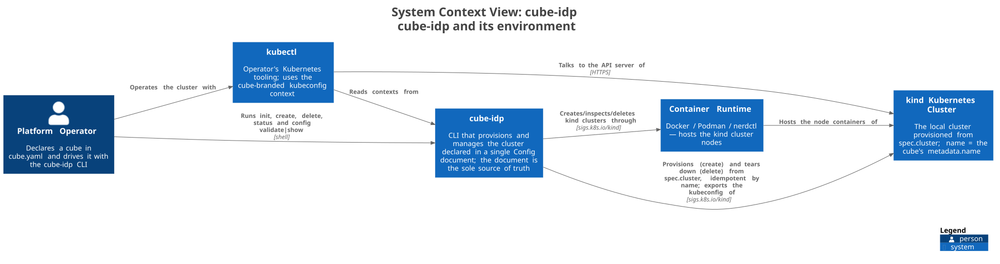
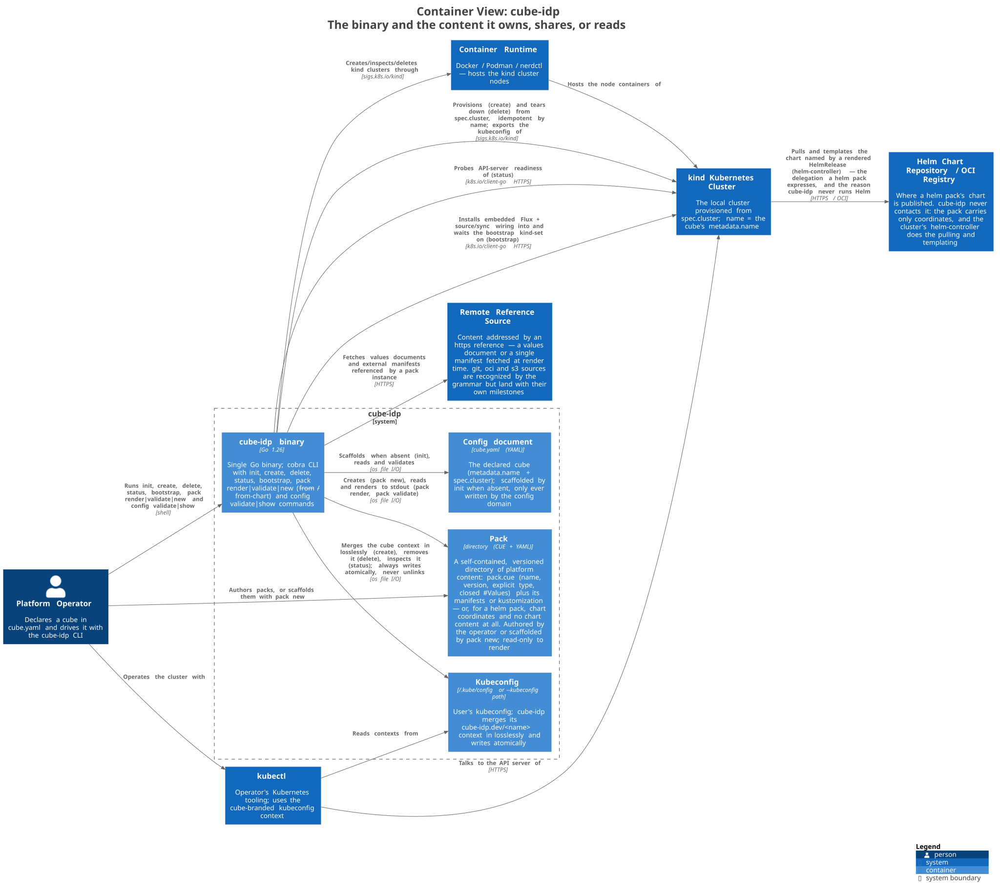
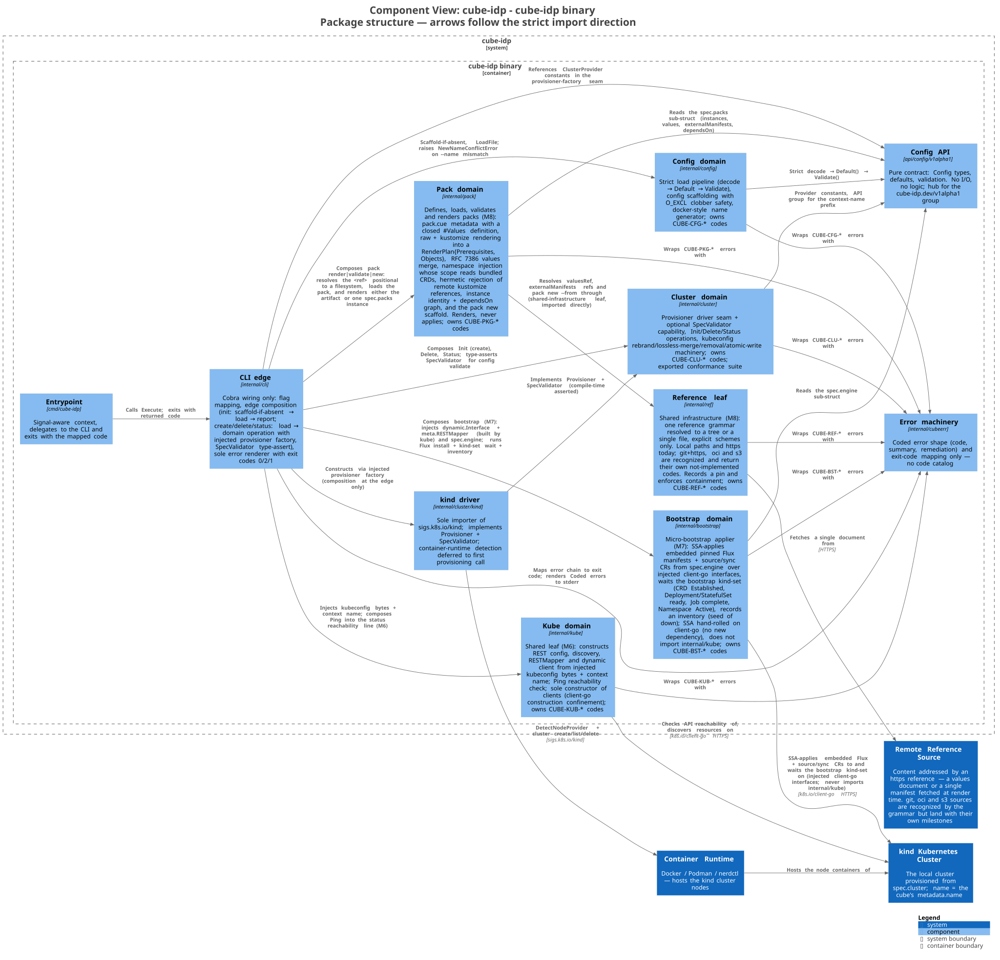

# cube-idp architecture (living document)

This is the binding, cross-cutting architecture of cube-idp — updated in
place as domains land, never forked into dated copies. Per-domain contracts
live in `docs/domains/<name>.md` (one file per domain, created when the
domain lands). Dated decisions and their rationale: `docs/DECISIONS.md`.
Pre-reset history: `docs/archived/` (read-only, not binding). The original
approved design this document grew from is
`docs/archived/design/2026-07-27-back-to-basics-structure.md`.

## 1. Structure in one line

Standard Go layout (`cmd/` + `internal/` + public `api/`); one package per
component domain inside `internal/`; consumer-side interfaces by default
with a driver-pattern exception for swappable backends; error machinery
separated from per-domain error catalogs; a thin phase-runner orchestrator
(future); CI-enforced size limits.

## 2. Layout and import direction

```
cmd/cube-idp ──▶ internal/cli ──▶ internal/config    ──▶ api/config/v1alpha1
                      │      ├──▶ internal/cluster   ──▶ api/config/v1alpha1
                      │      │        │  └── cluster/kind (driver subpackage)
                      │      ├──▶ internal/kube  (M6 shared-infra leaf: injected
                      │      │        kubeconfig bytes + context name → clients)
                      │      ├──▶ internal/bootstrap (M7: SSA-applies embedded Flux
                      │      │        via injected client-go ifaces → api/config)
                      │      ├──▶ internal/pack (M8: load/validate/render packs
                      │      │        │  → api/config; renders, never applies)
                      │      │        └──▶ internal/ref (M8 shared-infra leaf:
                      │      │               ref grammar → tree/file)
                      └──────┴──▶ internal/cubeerr ◀── (every package above)
```

Three package categories, and only these:

1. **`api/` and `internal/cubeerr`** — pure leaves: they import nothing
   from `internal/` — ever.
2. **Component domains** (`config`, `cluster`, `bootstrap`, `pack`) — one
   domain = one package = one `docs/domains/` file. **Domains never import
   each other.**
3. **Shared-infrastructure leaves** — a closed, listed set:
   **`internal/ref`** and **`internal/kube`** (the latter documented in
   `docs/domains/kube.md` since M6, which predates this category and does
   not make it a component domain). A component domain **MAY**
   import a listed leaf directly. A leaf **MAY NOT** import a component
   domain or `api/config`; it imports only `internal/cubeerr` and its own
   backend SDKs. Adding a package to this list is a design-gate event
   (2026-08-21), never an inference from shape: a package qualifies only
   when it is genuinely shared infrastructure with no domain concepts,
   and the alternative — re-implementing it per domain, or making one
   domain the accidental home of shared machinery — is worse.

   **MAY is not SHOULD.** Injection at the CLI/orchestrator edge remains
   the preferred crossing wherever the value is already an interface:
   `internal/bootstrap` deliberately does **not** import `internal/kube`,
   and the M7 contract stands unchanged. `internal/pack` imports
   `internal/ref` directly because what crosses is a concrete resolver
   with no second implementation, and a `Resolver` interface would be
   premature under the doctrine in §4.

- Imports flow strictly left to right.
- `internal/kube` is a shared-infrastructure leaf (M6): it imports only
  `internal/cubeerr`, `k8s.io/client-go`, and `k8s.io/apimachinery` —
  never `api/` or any domain. Kubeconfig bytes and the context name are
  injected by the
  CLI/orchestrator edge; the domain never reads files and never derives
  the `cube-idp.dev/<name>` context name itself.
- `internal/bootstrap` (M7) is the **micro-bootstrap applier**: it
  SSA-applies the embedded, pinned Flux install manifests plus the
  source/sync CRs derived from `spec.engine`, waits on the bootstrap
  kind-set, records an inventory, then hands over permanently — steady-state
  ownership of all packs/manifests is the engine's (no-engine operation is
  not a supported mode). It imports `api/config` (the `spec.engine`
  sub-struct) and `internal/cubeerr`, and embeds the Flux manifests as data.
  Its SSA/readiness machinery runs against **injected client-go interface
  types** (`dynamic.Interface`, `meta.RESTMapper`) supplied by the CLI edge —
  it **does not import `internal/kube`** (domains never import each other;
  `kube`'s construction output crosses the edge as interfaces, per that
  domain's contract). SSA is hand-rolled on client-go; readiness predicates
  read off `unstructured` status (no kstatus/`cli-utils`, no
  controller-runtime).
- `internal/pack` (M8) **defines, loads, validates, and renders** packs —
  it never applies anything. Under delivery-through-engine, packs reach a
  cluster by being written into the source Flux watches (M11); rendering
  is a pure function of its inputs, so the domain is hermetic and has no
  e2e. It imports `api/config` (the `spec.packs` sub-struct),
  `internal/cubeerr`, apimachinery/yaml, `cuelang.org/go`, and the
  `internal/ref` leaf.
- Domains never import each other. Values cross domains by injection at
  the CLI/orchestrator edge, where factories and composition live. The
  one sanctioned exception is a listed shared-infrastructure leaf, above.
- One component domain = one package under `internal/` = one file under
  `docs/domains/`. New components add a package; they never grow an
  existing one. A shared-infrastructure leaf is not a component domain:
  it is documented inside its consumer's contract until a second consumer
  makes a file of its own worth having (`internal/ref` lives in
  `docs/domains/pack.md` today; `internal/kube` has its own file from M6).
- Driver subpackages (`internal/cluster/kind`) are the only importers of
  their backend SDK.

## 3. The Config API

One aggregate `Config` kind in root group `cube-idp.dev` (`v1alpha1`),
KRM-shaped and CRD-ready: real `metav1.TypeMeta`/`ObjectMeta`, deepcopy
generated by controller-gen and committed. `ConfigSpec` grows exactly one
typed sub-struct per component, with its defaults and validation beside it;
the loading machinery never changes. Load pipeline order is fixed: strict
decode → `Default()` → `Validate()`; a non-nil `*Config` is always complete
and valid. Per-component API groups (`<component>.cube-idp.dev`) are
reserved for kinds a component actually owns, never applied preemptively.

## 4. Interface doctrine

Two kinds of seams, bright line between them:

- **Kind A — consumer-side (the default):** the consuming package defines
  the 1–3 method interface it needs, only once a real second consumer or
  implementation exists. Domains return concrete structs. Mocks are
  hand-rolled function-field structs — no mockgen. Test seams are
  injected — a factory is passed as a parameter or struct field to the
  code that uses it, never exposed as a mutable package-level `var` that
  tests overwrite with save/restore; mutable package-level state is
  banned outside `main`.
- **Kind B — driver seams (the exception):** only for genuinely swappable
  backends (cluster providers, gitops engines). Interface + exported
  `Run<Seam>Conformance(t, factory)` suite live in the domain package;
  implementations live in subpackages and each runs the shared suite.
  Interfaces stay pure where possible (return objects; the caller
  applies); optional capabilities are separate small type-asserted
  interfaces; seams narrow over time, never widen casually.

Current seams: `cluster.Provisioner` (Kind B, kind driver).

## 5. Error architecture

Machinery (`internal/cubeerr`: `Code`, `Coded`, `Wrap`, `ExitCode`) is
separated from catalogs and never grows one. Each domain owns its
`CUBE-<TAG>-NNN` codes in its own `errors.go`; every user-reaching error is
a `*cubeerr.Coded` with summary + remediation wrapping the technical cause
(`%w` on every hop). Coded-error constructors are functions named
`new<Thing>Error` (exported: `New<Thing>Error`) — the `Err` prefix is
reserved for sentinel `var`s comparable with `errors.Is`, and this repo
has none; error identity is always the `cubeerr.Code`, asserted via
`errors.As`. Only `internal/cli/exit.go` renders errors and maps
exit codes: 0 success, 2 config error, 1 anything else. Domains never
print.

Tag registry (a new component adds a row; nothing renumbers):

| Tag | Component | Package | Status |
|---|---|---|---|
| `CFG` | config (api types + loader) | `internal/config` | active |
| `CLI` | cli / output | `internal/cli` | active |
| `CLU` | cluster provider | `internal/cluster` | active (M3) |
| `KUB` | kube client access | `internal/kube` | active (M6) |
| `BST` | bootstrap (Flux install + wait + inventory) | `internal/bootstrap` | active (M7) |
| `ENG` | gitops engine (seam + Flux-as-pack) | `internal/engine` | reserved (M10) |
| `PKG` | pack contract, values, render, identity + deps | `internal/pack` | active (M8) |
| `REF` | reference resolution (grammar → tree/file) | `internal/ref` | active (M8) |
| `REG` | registry / OCI **publish** side | `internal/registry` | reserved |
| `APP` | apply / SSA / inventory | `internal/apply` | superseded (M7 — SSA absorbed privately by `internal/bootstrap`; no standalone apply domain, see 2026-08-06) |
| `TLS` | trust / certificates / CA | `internal/trust` | reserved |
| `SPK` | spokes | `internal/spoke` | reserved |
| `ORC` | orchestrator (phases) | `internal/orchestrator` | reserved |

`REF` and `REG` split OCI cleanly and must stay split: `ref` is the
**read** side (resolve a reference to a tree or a file, for any backend);
`registry` is the **publish** side (pushing pack artifacts). Neither owns
the other's errors. `PKG` no longer covers fetching — that moved to `REF` —
nor delivery, which is M11's.

## 6. Orchestration guard (future)

When `up` arrives it is a kubeadm-style phase runner: `[]Phase{Name, Run}`
sequenced by a function that only orders and times out. The orchestrator
depends on interfaces injected via a deps struct — it sequences, it never
decides. Leaf domains stay leaf; composition stays at the CLI/orchestrator
edge; size limits (function <50 lines, file <300) are CI-enforced.

## 7. Testing strategy

Table-driven tests wherever cases share one code path; error paths are
first-class rows. When cases need conditional setup, per-case mocking,
or branching assertions, write separate test functions instead of
forcing a table — a table with `if tt.explicit`-style branches is a
smell, not compliance. Error *identity* is asserted via `errors.As` into
`*cubeerr.Coded` + code equality — never by matching message strings.
Substring checks are fine for what they actually test: rendered CLI
output (codes, field paths, remediation on stderr) and context carried
in messages (paths). Golden files are the one sanctioned byte-exact
check, for CLI stdout. Tests and conformance suites obtain their context
from `t.Context()`, never `context.Background()` — cancellation at test
end is part of the contract being exercised. Filesystem access through
injected `fs.FS`, mocked with `fstest.MapFS`. Driver seams ship conformance suites
designed to run without live infrastructure (stateful fakes in the green
gate); real-backend runs are opt-in (`make test-e2e`) and never part of the
gate.

## 8. Dependencies

Runtime dependencies are a closed set; adding one requires an
owner-approved architecture/decision update, never a plan footnote:

| Module | Why | Confinement |
|---|---|---|
| `k8s.io/apimachinery` | metav1 types, validation/field — the KRM convention | — |
| `sigs.k8s.io/yaml` | strict YAML→JSON decoding honoring json tags | — |
| `github.com/spf13/cobra` | CLI framework (K8s ecosystem norm) | `internal/cli` |
| `sigs.k8s.io/kind` | library-first cluster provisioning (M3) | `internal/cluster/kind` only |
| `k8s.io/client-go` | Kubernetes client construction — REST config from kubeconfig bytes, discovery, RESTMapper, dynamic client (M6); everything downstream (apply, engine, doctor) builds on it | construction confined to `internal/kube` (see below) |
| `cuelang.org/go` | the pack metadata language (M8) — `#Values` is a **closed** definition, so a pack author can lock down, expose, and default their values surface; no cheaper format offers that | `internal/pack` metadata/values files only |
| `sigs.k8s.io/kustomize/api` + `kyaml` | kustomize rendering (M8) — building a kustomization is the tool's own job; exec-ing `kubectl kustomize` was rejected (no runtime dependency on a binary we do not ship) | `internal/pack/kustomize.go` only |

Build-only: `sigs.k8s.io/controller-tools` (controller-gen, pinned Go tool
dependency). Heavy SDKs adopted later are confined to a single importing
file or subpackage. `k8s.io/client-go` deviates deliberately (decision
2026-08-04): its confinement is **construction-scoped** — only
`internal/kube` turns kubeconfig bytes into clients, but consumers may
reference its stable interface types (e.g. `dynamic.Interface`,
`meta.RESTMapper`) in signatures rather than mirror-wrapping them;
client-go sits closer to apimachinery's status than to kind's. Its version
is pinned to the apimachinery minor.

**M8 (pack) adds two runtime dependencies, each at its own gate:**
`cuelang.org/go` (2026-08-21, the design gate) and
`sigs.k8s.io/kustomize/api` + `kyaml` (with kustomize rendering). Both are
confined to a single file or file-group inside `internal/pack`; the
kustomize SDK is imported by `kustomize.go` and nothing else.

Kustomize carries one behaviour worth recording here, because it shapes the
domain's contract: **it resolves remote references over the network
unconditionally, and `krusty.Options` has no switch to forbid it.** Since
rendering is defined as a pure function of its inputs, `internal/pack`
rejects remote references in a pack payload before invoking kustomize
(`CUBE-PKG-021`) rather than letting a render reach the network. See
`docs/domains/pack.md`.

Still deferred to their own gates, and not importable before then:
`go-git/v5` (git backend), `oras-go/v2` (OCI backend, aligned with M11),
and the AWS SDK (S3 backend, on demand). `internal/ref`'s M8 backends —
local tree/file and HTTPS file — are **stdlib-only**. Exec-ing
`kubectl kustomize` stays rejected.

**`helm.sh/helm/v4` is removed from the deferred set** (decision
2026-08-23) — not deferred further, but *not owed at all*. Helm packs
delegate: a `type: helm` pack renders to a Flux `HelmRelease` plus its
source CR and the engine's helm-controller templates the chart in cluster,
so cube-idp never runs Helm and emitting the CRs is `unstructured` plus
apimachinery. **M9 (helm packs) therefore adds no runtime dependency**, the
same outcome M7 reached by embedding Flux rather than importing it. See
`docs/domains/pack.md`.

**M9 promotes one indirect module, which is not a gate event.**
`chart.version` is validated by a real SemVer parser rather than by a CUE
regex, using **`golang.org/x/mod/semver`** — already in the module graph
(indirect, via the k8s/cue/kustomize trees), so importing it directly drops
an `// indirect` marker and changes neither `go.sum` nor the closed runtime
set above. Adding a *new* module for this — `Masterminds/semver/v3`, Helm's
own, the fallback if the canonical round-trip proves too strict — **would**
be an §8 event and gets one if it happens. Confined to `internal/pack`.

**M9 extends the embedded Flux asset, not the dependency table.** The
vendored `flux install --export` output gains **helm-controller** and the
`helmreleases.helm.toolkit.fluxcd.io` CRD — regenerated at the pinned
v2.9.2 with `--components=source-controller,kustomize-controller,helm-controller`
and re-pinned by sha256. It stays what it already was: external data with
recorded provenance, regenerated by a `make` target, never fetched at
runtime. The bootstrap kind-set needs no change (it filters by kind).

**M7 (bootstrap) adds no runtime dependency** — a deliberate, load-bearing
outcome of two M7 decisions (2026-08-06). The Flux install manifests are
**embedded data** (`go:embed` of vendored `flux install --export` output),
not a Go import: the binary carries pinned bytes, gated by a version
constant + recorded sha256 provenance and regenerated by a `make` target —
never fetched at runtime (hermetic gate + air-gap posture preserved). SSA
and the readiness wait are **hand-rolled on the already-present
`k8s.io/client-go` and `k8s.io/apimachinery`**: the measured alternative,
`fluxcd/pkg/ssa`, would have added +37 modules, +72 `go.sum` lines, and
~3.6 MB to the binary while back-dooring `sigs.k8s.io/controller-runtime`
past the M6 gate's explicit rejection — rejected for a job reduced to
applying one known manifest set. The vendored Flux manifests are an
external artifact with recorded provenance, not a dependency-table row.

## 9. Architecture diagrams (C4)

C4 views of the system, exported from the Structurizr model at
`docs/architecture/workspace.dsl` (the source of truth, which also carries
the regeneration commands). The SVG images embedded below live in
`docs/architecture/` and are rendered from that DSL via the
c4-architecture pipeline (C4-PlantUML) — regenerated, never hand-edited.
Arrow labels are the relationship action with its technology in
brackets; each diagram carries its own legend.

System context — who and what surrounds the cube-idp binary:



Containers — the binary and the content it owns, shares, or reads on
the operator's machine:



Components — the packages inside the binary and their import direction:


